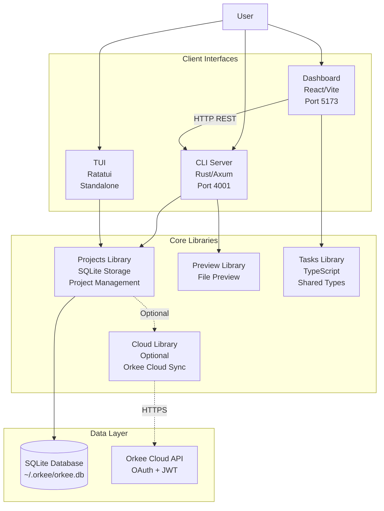
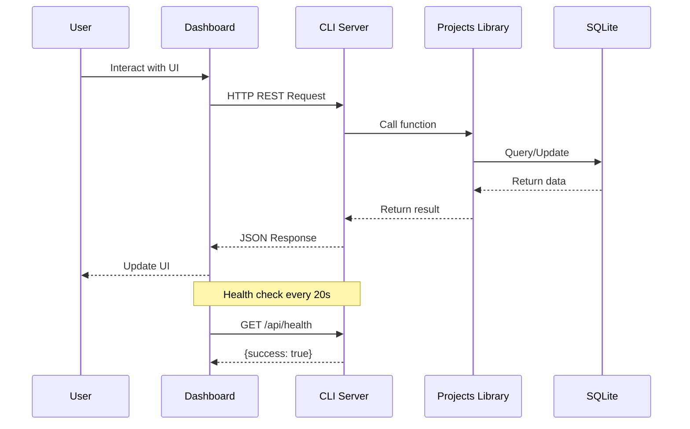
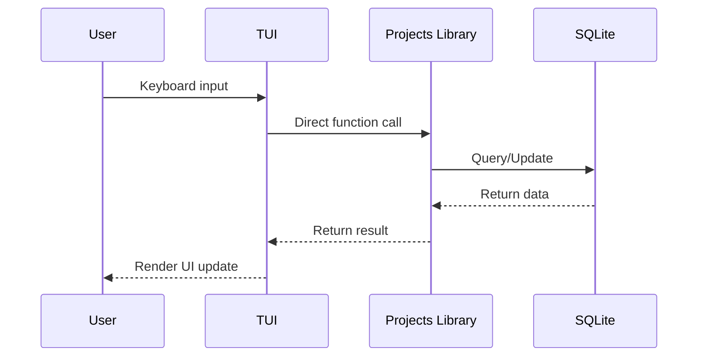

# Architecture Overview

Orkee is built as a modern, local-first AI agent orchestration platform with a five-package monorepo architecture. This document provides a comprehensive overview of the system's architecture, design decisions, and technical implementation.

## System Architecture Overview

Orkee follows a **local-first architecture** with optional cloud sync capabilities. The system is designed around a SQLite database that stores all project data locally, ensuring full functionality works offline while providing optional backup and sync through Orkee Cloud.



## Five-Package Monorepo Structure

Orkee's codebase is organized as a Turborepo monorepo with five core packages and additional supporting packages:

### Core Packages

#### 1. CLI Server (`packages/cli/`)

The CLI package provides both a command-line interface and a REST API server built with Rust and Axum.

**Technology Stack:**
- **Framework**: Axum (Rust web framework)
- **Runtime**: Tokio (async runtime)
- **HTTP Middleware**: Tower and Tower-HTTP
- **CLI Framework**: Clap (command-line argument parsing)
- **Security**: rustls (TLS), rcgen (certificate generation)
- **Rate Limiting**: Governor and tower_governor

**Key Features:**
- REST API on port 4001 (configurable via `--api-port` or `ORKEE_API_PORT`)
- Serves dashboard UI on port 5173 (configurable via `--ui-port` or `ORKEE_UI_PORT`)
- Native HTTPS/TLS support with auto-generated certificates
- Per-endpoint rate limiting with burst protection
- Path validation and sandboxing for filesystem operations
- CORS protection with configurable allowlist
- Request ID tracking for error tracing

**Binary Targets:**
- `orkee` - Main CLI entry point with command routing

#### 2. Dashboard (`packages/dashboard/`)

A React-based single-page application providing a web interface for monitoring and managing projects.

**Technology Stack:**
- **Framework**: React 18 with TypeScript
- **Build Tool**: Vite
- **Routing**: React Router v7
- **UI Components**: Shadcn/ui (Radix UI primitives)
- **Styling**: Tailwind CSS with tailwindcss-animate
- **State Management**:
  - React Context (ConnectionContext for server connection)
  - TanStack Query (React Query) for server state management
- **Desktop**: Tauri (optional desktop app wrapper)

**Key Pages:**
- Usage - Overview and metrics
- Projects - Project management interface
- AIChat - AI interaction interface
- MCPServers - MCP server configuration
- Monitoring - System monitoring
- Settings - Configuration management

**State Management:**
- `ConnectionContext` manages server connection and health checks
- Polls health endpoints every 20 seconds to verify server availability
- Generic API client wrapper with error handling

#### 3. TUI (`packages/tui/`)

A standalone terminal interface built with Ratatui, providing an interactive command-line experience.

**Technology Stack:**
- **Framework**: Ratatui (terminal UI framework)
- **Backend**: Crossterm (cross-platform terminal manipulation)
- **Event System**: Custom EventHandler with sender/receiver channels

**Architecture:**
- **Direct Library Access**: Uses orkee-projects library directly (no HTTP client)
- **Event-Driven**: EventHandler manages keyboard and tick events
- **State Management**: AppState struct manages projects and screen navigation
- **Standalone**: No server dependency required

**Key Features:**
- Rich interactive terminal interface
- Real-time project browsing and management
- Configurable refresh intervals
- Theme support (dark/light)

#### 4. Projects Library (`packages/projects/`)

The core shared library providing project management functionality with SQLite storage.

**Technology Stack:**
- **Database**: SQLx (async SQLite driver)
- **Storage**: SQLite with WAL mode
- **Serialization**: Serde (JSON)
- **Git Integration**: git2-rs
- **Async**: Tokio and async-trait

**Core Components:**
- `ProjectManager` - CRUD operations and business logic
- `SqliteStorage` - Database access layer
- HTTP handlers for Axum integration
- Full-text search using FTS5

**Key Features:**
- ACID transactions for data integrity
- Full-text search across project metadata
- Automatic Git repository detection
- Schema migrations
- Optional cloud sync integration

#### 5. Cloud Library (`packages/cloud/`)

Optional cloud sync functionality providing backup and synchronization with Orkee Cloud.

**Technology Stack:**
- **Authentication**: Token-based OAuth
- **HTTP Client**: Reqwest
- **Serialization**: Serde JSON

**Architecture:**
- Optional feature flag (`cloud`) for compilation
- Token-based authentication with Orkee Cloud API
- Transport layer security (TLS) for all communications
- Subscription tier validation

**Key Features:**
- OAuth authentication flow
- Project backup and restore
- Cloud snapshot management
- Sync state tracking
- Subscription management

### Supporting Packages

#### Preview Library (`packages/preview/`)
Provides file preview functionality with support for various file types and MIME type detection.

#### Tasks Library (`packages/tasks/`)
TypeScript library providing shared task management types and interfaces for the dashboard.

#### MCP Server (`packages/mcp-server/`)
Model Context Protocol server implementation for Claude AI integration.

## Communication Architecture

### Port Configuration

Orkee uses a flexible port configuration system:

| Component | Default Port | Configuration Method |
|-----------|--------------|----------------------|
| API Server | 4001 | `--api-port`, `ORKEE_API_PORT` |
| Dashboard UI | 5173 | `--ui-port`, `ORKEE_UI_PORT` |

**Port Selection Logic:**
1. Command-line flags take highest precedence
2. Environment variables as fallback
3. Default ports if neither specified
4. Auto-discovery if port is in use (optional with portpicker)

### API Architecture

**REST API Format:**
All API responses follow a consistent format:

```typescript
{
  success: boolean;
  data: any;         // Response data on success
  error: string | null;  // Error message on failure
}
```

**Core Endpoints:**

| Endpoint | Method | Description |
|----------|--------|-------------|
| `/api/health` | GET | Health check endpoint |
| `/api/status` | GET | Extended status information |
| `/api/projects` | GET | List all projects |
| `/api/projects/:id` | GET | Get project by ID |
| `/api/projects/by-name/:name` | GET | Get project by name |
| `/api/projects/by-path` | POST | Get project by path |
| `/api/projects` | POST | Create new project |
| `/api/projects/:id` | PUT | Update project |
| `/api/projects/:id` | DELETE | Delete project |
| `/api/directories/list` | GET | Browse filesystem |

**CORS Configuration:**
- Automatically configured based on UI port
- Allows localhost origins in development
- Configurable via `ORKEE_CORS_ORIGIN`
- Development mode allows any localhost origin

### Component Communication Patterns



**TUI Direct Access:**


## Database Architecture

### SQLite Storage Design

Orkee uses SQLite as its primary data store with the following configuration:

**PRAGMA Settings:**
- `foreign_keys = ON` - Enforce referential integrity
- `journal_mode = WAL` - Write-Ahead Logging for better concurrency
- `synchronous = NORMAL` - Balance between safety and performance
- `temp_store = MEMORY` - Use memory for temporary tables
- `cache_size = -64000` - 64MB cache size

### Schema Design

#### Projects Table

The core `projects` table stores all project metadata:

```sql
CREATE TABLE projects (
    -- Core fields
    id TEXT PRIMARY KEY NOT NULL,
    name TEXT NOT NULL UNIQUE,
    project_root TEXT NOT NULL UNIQUE,
    description TEXT,

    -- Status and priority
    status TEXT NOT NULL DEFAULT 'planning',
    priority TEXT NOT NULL DEFAULT 'medium',
    rank INTEGER,

    -- Scripts (nullable)
    setup_script TEXT,
    dev_script TEXT,
    cleanup_script TEXT,

    -- Task configuration
    task_source TEXT,

    -- Complex data as JSON (nullable)
    tags TEXT,           -- JSON array of strings
    manual_tasks TEXT,   -- JSON array of task objects
    mcp_servers TEXT,    -- JSON array of MCP configs
    git_repository TEXT, -- JSON object with repo info

    -- Timestamps
    created_at TEXT NOT NULL DEFAULT (datetime('now', 'utc')),
    updated_at TEXT NOT NULL DEFAULT (datetime('now', 'utc'))
);
```

**Status Values:**
- `planning` - Initial planning phase
- `building` - Active development
- `review` - Under review
- `launched` - Deployed/released
- `on-hold` - Temporarily paused
- `archived` - Completed or abandoned

**Priority Values:**
- `low` - Non-urgent
- `medium` - Standard priority
- `high` - Urgent or important

#### Full-Text Search

FTS5 virtual table for high-performance search:

```sql
CREATE VIRTUAL TABLE projects_fts USING fts5(
    id UNINDEXED,
    name,
    description,
    project_root,
    tags,
    content='projects',
    content_rowid='rowid'
);
```

**Automatic Sync Triggers:**
- Insert trigger: Adds new projects to FTS index
- Update trigger: Updates FTS index (delete old, insert new)
- Delete trigger: Removes from FTS index
- Updated timestamp trigger: Automatically updates `updated_at`

#### Cloud Sync Tables

Tables for managing cloud synchronization (optional):

```sql
-- Snapshots for backup
CREATE TABLE sync_snapshots (
    id TEXT PRIMARY KEY NOT NULL,
    created_at TEXT NOT NULL,
    compressed_data BLOB NOT NULL,
    checksum TEXT NOT NULL,
    size_bytes INTEGER NOT NULL,
    project_count INTEGER NOT NULL,
    sync_status TEXT NOT NULL DEFAULT 'pending'
);

-- Sync state tracking
CREATE TABLE sync_state (
    id TEXT PRIMARY KEY NOT NULL,
    user_id TEXT,
    device_id TEXT,
    last_sync_at TEXT,
    last_snapshot_id TEXT,
    conflict_resolution TEXT DEFAULT 'manual',
    created_at TEXT NOT NULL,
    updated_at TEXT NOT NULL
);
```

#### Storage Metadata

Versioning and configuration tracking:

```sql
CREATE TABLE storage_metadata (
    key TEXT PRIMARY KEY NOT NULL,
    value TEXT NOT NULL,
    updated_at TEXT NOT NULL
);
```

**Initial Metadata:**
- `schema_version` - Current schema version
- `created_at` - Database creation timestamp
- `storage_type` - Storage backend identifier

### Performance Optimization

**Indexes:**
- Single-column indexes on frequently queried fields (name, status, priority, rank)
- Composite indexes for common query patterns (status+priority, status+rank)
- Timestamp indexes for time-based queries
- FTS5 indexes for search

**Database Views:**
```sql
-- Active projects (commonly filtered status)
CREATE VIEW active_projects AS
SELECT * FROM projects
WHERE status IN ('planning', 'building', 'review')
ORDER BY rank ASC, name ASC;

-- Projects with Git info (JSON extraction)
CREATE VIEW projects_with_git AS
SELECT
    *,
    json_extract(git_repository, '$.owner') as git_owner,
    json_extract(git_repository, '$.repo') as git_repo,
    json_extract(git_repository, '$.branch') as git_branch
FROM projects
WHERE git_repository IS NOT NULL;
```

### Migration Strategy

**Schema Migrations:**
- Numbered migration files (`001_initial_schema.sql`)
- SQLx compile-time verification
- Automatic migration on startup
- Version tracking in `storage_metadata`

**Legacy JSON Migration:**
- Automatic detection of `~/.orkee/projects.json`
- One-time migration to SQLite on first run
- Preserves all existing project data
- Backup of original JSON file

## Security Architecture

### Path Validation & Sandboxing

Orkee implements a three-tier security model for filesystem access:

**Security Modes:**

1. **Strict Mode** (`BROWSE_SANDBOX_MODE=strict`)
   - Only explicitly allowed paths
   - No path traversal permitted
   - Highest security level

2. **Relaxed Mode** (default)
   - Home directory + configured allowed paths
   - Blocks dangerous system directories
   - Balanced security and usability

3. **Disabled Mode** (`BROWSE_SANDBOX_MODE=disabled`)
   - No restrictions
   - Not recommended for production

**Always Blocked Paths:**
- System directories: `/etc`, `/sys`, `/proc`, `/usr/bin`, `/usr/sbin`
- Sensitive user directories: `.ssh`, `.aws`, `.gnupg`, `.password-store`
- Temporary directories with sensitive data

**Default Allowed Paths:**
```
~/Documents
~/Projects
~/Desktop
~/Downloads
```

Configurable via `ALLOWED_BROWSE_PATHS` environment variable.

### TLS/HTTPS Support

**Native Rust Implementation:**
- **Library**: rustls (no OpenSSL dependency)
- **Certificate Generation**: rcgen for development certificates
- **Auto-Generation**: Automatic self-signed certificate creation
- **Custom Certificates**: Support for production certificates

**Configuration:**
```bash
TLS_ENABLED=true
TLS_CERT_PATH=~/.orkee/certs/cert.pem
TLS_KEY_PATH=~/.orkee/certs/key.pem
AUTO_GENERATE_CERT=true
ENABLE_HSTS=false  # HTTP Strict Transport Security
```

**Port Behavior:**
- HTTPS on configured API port (default 4001)
- HTTP redirect from port 4000 → HTTPS (when enabled)

### Rate Limiting

Per-endpoint rate limiting using Governor crate with token bucket algorithm:

| Endpoint Category | Default Limit | Burst Size |
|------------------|---------------|------------|
| Health checks | 60/min | 5x |
| Directory browsing | 20/min | 5x |
| Projects API | 30/min | 5x |
| Preview operations | 10/min | 5x |
| Global default | 30/min | 5x |

**Configuration:**
```bash
RATE_LIMIT_ENABLED=true
RATE_LIMIT_HEALTH_RPM=60
RATE_LIMIT_BROWSE_RPM=20
RATE_LIMIT_PROJECTS_RPM=30
RATE_LIMIT_PREVIEW_RPM=10
RATE_LIMIT_BURST_SIZE=5
```

### Security Headers

Automatically applied security headers:

- **Content Security Policy (CSP)**: Restricts resource loading
- **X-Frame-Options**: Prevents clickjacking (DENY)
- **X-Content-Type-Options**: Prevents MIME sniffing (nosniff)
- **HTTP Strict Transport Security (HSTS)**: Forces HTTPS (optional)
- **Request ID**: Unique identifier for request tracing

**Configuration:**
```bash
SECURITY_HEADERS_ENABLED=true
ENABLE_REQUEST_ID=true
```

### Cloud Security

**Authentication:**
- Token-based authentication with Orkee Cloud API
- OAuth flow for user authentication
- JWT validation on cloud side

**Access Control:**
- Token-based authorization
- Subscription tier validation
- Row Level Security (RLS) in cloud database

**Data Protection:**
- Transport layer security (TLS) for all API communications
- No encryption of local database (relies on OS-level encryption)
- Cloud handles data integrity and backups

**Configuration:**
```bash
ORKEE_CLOUD_TOKEN=<auth_token>
ORKEE_CLOUD_API_URL=https://api.orkee.ai
```

## Technology Stack Summary

### Backend (Rust)

| Category | Technology | Purpose |
|----------|-----------|---------|
| Web Framework | Axum 0.7 | HTTP server and routing |
| Async Runtime | Tokio 1.0 | Asynchronous execution |
| Database | SQLx 0.8 | SQLite async driver |
| CLI | Clap 4.0 | Command-line parsing |
| Security | rustls 0.21 | TLS/HTTPS |
| Rate Limiting | Governor 0.6 | Request throttling |
| Git | git2 0.18 | Git operations |
| TUI | Ratatui 0.28 | Terminal interface |
| Serialization | Serde 1.0 | JSON serialization |

### Frontend (TypeScript/React)

| Category | Technology | Purpose |
|----------|-----------|---------|
| Framework | React 18 | UI framework |
| Build Tool | Vite 7.1 | Development and bundling |
| Routing | React Router 7 | Client-side routing |
| UI Components | Radix UI | Accessible primitives |
| Styling | Tailwind CSS 3.4 | Utility-first CSS |
| State | TanStack Query 5 | Server state management |
| Desktop | Tauri 2.8 | Desktop app wrapper |
| Drag & Drop | dnd-kit | Drag and drop |
| Icons | Lucide React | Icon library |

### Development Tools

| Category | Technology | Purpose |
|----------|-----------|---------|
| Monorepo | Turborepo | Task orchestration |
| Package Manager | pnpm | Node.js packages |
| Rust Build | Cargo | Rust compilation |
| Testing | rstest, Jest | Unit/integration tests |
| Linting | ESLint, Clippy | Code quality |

## Design Decisions & Rationale

### Local-First Architecture

**Decision:** Use SQLite as the primary data store with optional cloud sync.

**Rationale:**
- **Performance**: Local database eliminates network latency
- **Reliability**: Full functionality works offline
- **Privacy**: User data stays on their machine by default
- **Simplicity**: No complex server infrastructure required
- **ACID Guarantees**: SQLite provides strong consistency guarantees

**Trade-offs:**
- Multi-device sync requires cloud integration
- Single-writer limitation (mitigated by WAL mode)
- No built-in collaboration features

### Rust + React Combination

**Decision:** Rust backend with React frontend.

**Rationale:**
- **Performance**: Rust provides native-level performance and low resource usage
- **Safety**: Rust's memory safety prevents common security vulnerabilities
- **Concurrency**: Tokio enables efficient async operations
- **Developer Experience**: React ecosystem provides excellent UI development tools
- **Type Safety**: TypeScript + Rust provides end-to-end type safety

**Trade-offs:**
- Longer compile times during development
- Steeper learning curve for contributors
- More complex build pipeline

### Monorepo Structure

**Decision:** Five-package monorepo with Turborepo.

**Rationale:**
- **Code Sharing**: Shared types and libraries between packages
- **Consistent Versioning**: All packages versioned together
- **Simplified Development**: Single repository to clone and manage
- **Task Orchestration**: Turborepo handles build dependencies efficiently

**Trade-offs:**
- Larger repository size
- More complex CI/CD setup
- Requires understanding of monorepo tooling

### TUI as Standalone Component

**Decision:** TUI directly uses projects library without server.

**Rationale:**
- **Performance**: No HTTP overhead for terminal operations
- **Simplicity**: No server dependency required
- **Use Case Fit**: Terminal users often prefer offline tools

**Trade-offs:**
- Code duplication between TUI and CLI (different interaction models)
- Cannot leverage HTTP caching
- Requires linking projects library

### Optional Cloud Sync

**Decision:** Cloud features as optional compile-time feature flag.

**Rationale:**
- **Binary Size**: Users without cloud needs get smaller binaries
- **Compilation Speed**: Faster builds without cloud dependencies
- **Security**: Reduces attack surface for local-only usage
- **License Compliance**: Optional features easier to maintain

**Trade-offs:**
- Requires maintaining two compilation paths
- Documentation must cover both modes
- Testing complexity increases

### SQLite Over Traditional Database

**Decision:** SQLite instead of PostgreSQL/MySQL.

**Rationale:**
- **Zero Configuration**: No separate database server required
- **Portability**: Single file database
- **Performance**: Excellent for read-heavy workloads
- **Embedded**: Runs in-process with application
- **ACID Compliance**: Full transaction support

**Trade-offs:**
- Limited concurrency (single writer)
- No built-in replication
- Less suitable for multi-user scenarios

### REST API Over GraphQL

**Decision:** Simple REST API with consistent response format.

**Rationale:**
- **Simplicity**: Easy to understand and use
- **Tooling**: Universal HTTP client support
- **Performance**: No query parsing overhead
- **Type Safety**: TypeScript provides client type safety

**Trade-offs:**
- Multiple requests for related data
- No query optimization on client side
- Fixed response shapes

## Deployment Architecture

### Deployment Options

1. **Local Development**
   - `turbo dev` for full development environment
   - Separate package development with filters
   - Hot reload for both frontend and backend

2. **Binary Distribution**
   - Single binary via `cargo build --release`
   - Optional cloud features with `--features cloud`
   - Platform-specific binaries for Linux, macOS, Windows

3. **Docker Containers**
   - Dockerfile in `deployment/docker/`
   - Docker Compose configuration
   - Nginx reverse proxy support

4. **SystemD Service**
   - Service files in `deployment/systemd/`
   - Automatic restart on failure
   - System integration

5. **Cloud Deployment**
   - AWS, GCP, Azure support
   - Load balancer integration
   - Managed certificate handling

### Production Configuration

**Recommended Settings:**
```bash
# Security
TLS_ENABLED=true
BROWSE_SANDBOX_MODE=strict
SECURITY_HEADERS_ENABLED=true
ENABLE_HSTS=true

# Rate Limiting
RATE_LIMIT_ENABLED=true
RATE_LIMIT_BROWSE_RPM=20
RATE_LIMIT_PROJECTS_RPM=30

# Performance
ORKEE_API_PORT=4001
ORKEE_UI_PORT=5173
```

See `deployment/README.md` for comprehensive deployment guide.

## Future Architecture Considerations

### Planned Enhancements

1. **WebSocket Support**
   - Real-time updates for dashboard
   - Live project status changes
   - Collaborative editing support

2. **Plugin System**
   - Third-party integrations
   - Custom project types
   - Extended functionality

3. **Multi-User Support**
   - Team collaboration features
   - Permission management
   - Shared project spaces

4. **Enhanced Cloud Sync**
   - Conflict resolution UI
   - Selective sync
   - Offline-first synchronization

5. **Mobile Support**
   - React Native app
   - Mobile-optimized UI
   - Push notifications

### Architecture Evolution

The architecture is designed to support future enhancements:

- **Service Mesh**: Optional microservices architecture for enterprise
- **Event Sourcing**: Audit trail and time-travel debugging
- **Multi-Database**: Support for PostgreSQL for enterprise deployments
- **GraphQL Layer**: Optional GraphQL API alongside REST
- **gRPC**: High-performance inter-service communication

## Conclusion

Orkee's architecture prioritizes local-first functionality, performance, and security while maintaining flexibility for cloud integration. The five-package monorepo structure provides clear separation of concerns while enabling code sharing. The Rust + React combination delivers both performance and developer experience, making Orkee a robust platform for AI agent orchestration.

For more detailed information on specific components, refer to the individual package documentation and source code in the repository.
