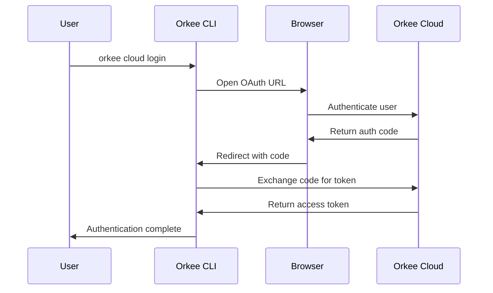

# Cloud Sync Configuration

Configure Orkee's cloud synchronization features to backup and sync your projects across multiple devices using Orkee Cloud.

## Overview

Orkee features a **SQLite-first architecture** with optional cloud synchronization:

- **Local-first**: Full functionality works offline with SQLite database
- **Optional cloud sync**: Backup and synchronization via Orkee Cloud API
- **Multi-device access**: Access your projects from anywhere
- **Secure authentication**: OAuth 2.0 with PKCE for security

:::info Cloud Features Requirement
Cloud sync functionality requires compilation with the `--features cloud` flag. This makes cloud functionality optional, keeping the binary smaller when cloud sync is not needed.

```bash
# Build with cloud sync features
cargo build --features cloud

# Or build without cloud features (smaller binary)
cargo build
```
:::

## Cloud Sync Architecture

### Orkee Cloud Integration

- **Direct API Integration**: Clean REST API integration with Orkee Cloud
- **OAuth Authentication**: Secure browser-based authentication flow
- **Project Synchronization**: Seamless sync of project metadata and configurations
- **Multi-device Support**: Access projects from any authenticated device

### Authentication Flow



## Configuration Variables

### Cloud Sync Variables

| Variable | Default | Description |
|----------|---------|-------------|
| `ORKEE_CLOUD_API_URL` | `https://api.orkee.ai` | Orkee Cloud API base URL |
| `ORKEE_CLOUD_TOKEN` | - | Authentication token (managed automatically) |

:::warning Token Management
Never set `ORKEE_CLOUD_TOKEN` manually. The token is managed automatically through the OAuth flow using `orkee cloud login`. Manual token setting can lead to authentication issues.
:::

### Configuration Files

Authentication data is stored securely in `~/.orkee/auth.toml`:

```toml
# This file is managed automatically by `orkee cloud login`
# Do not edit manually

[orkee_cloud]
token = "orkee_abc123..."
expires_at = "2024-12-31T23:59:59Z"
refresh_token = "orkee_refresh_xyz..."
```

**File Permissions**: Automatically set to `600` (owner read/write only) for security.

## Getting Started with Cloud Sync

### 1. Enable Cloud Features

Ensure Orkee is built with cloud features:

```bash
# Check if cloud features are available
orkee cloud status

# If not available, rebuild with cloud features
cargo build --features cloud --release
```

### 2. Authenticate with Orkee Cloud

```bash
# Start the OAuth authentication flow
orkee cloud login
```

This will:
1. Open your default browser
2. Navigate to the Orkee Cloud authentication page
3. Prompt you to sign in or create an account
4. Redirect back to the CLI with authentication tokens
5. Store tokens securely in `~/.orkee/auth.toml`

### 3. Verify Authentication

```bash
# Check authentication status
orkee cloud status
```

Expected output:
```
✓ Authenticated with Orkee Cloud
✓ Account: john@example.com
✓ Subscription: Pro Plan
✓ Token expires: 2024-12-31
✓ Last sync: 2024-01-15 10:30 UTC
```

### 4. Sync Your Projects

```bash
# Sync all projects to the cloud
orkee cloud sync

# Sync a specific project
orkee cloud sync --project <project-id>

# Force a complete resync
orkee cloud sync --force
```

## Cloud Sync Operations

### Available Commands

```bash
# Authentication
orkee cloud login              # Authenticate with Orkee Cloud
orkee cloud logout             # Sign out and remove local tokens
orkee cloud status             # Show authentication and sync status

# Project Synchronization
orkee cloud sync               # Sync all projects to cloud
orkee cloud sync --project ID  # Sync specific project
orkee cloud restore            # Restore projects from cloud
orkee cloud restore --project ID # Restore specific project

# Cloud Management
orkee cloud list               # List cloud-stored projects
orkee cloud list --limit 50    # List with custom limit
```

### Sync Modes

import Tabs from '@theme/Tabs';
import TabItem from '@theme/TabItem';

<Tabs>
<TabItem value="auto" label="Automatic Sync" default>

**Configuration:**
```bash
# Enable automatic sync (future feature)
ORKEE_CLOUD_AUTO_SYNC=true
ORKEE_CLOUD_SYNC_INTERVAL=300  # 5 minutes
```

**Behavior:**
- Automatically syncs changes in the background
- Configurable sync intervals
- Conflict resolution with local-first priority

</TabItem>
<TabItem value="manual" label="Manual Sync">

**Configuration:**
```bash
# Manual sync only (current default)
ORKEE_CLOUD_AUTO_SYNC=false
```

**Commands:**
```bash
# Sync when ready
orkee cloud sync

# Restore from cloud when needed
orkee cloud restore
```

</TabItem>
<TabItem value="ondemand" label="On-Demand Sync">

**Configuration:**
```bash
# Sync on specific operations
ORKEE_CLOUD_SYNC_ON_CREATE=true
ORKEE_CLOUD_SYNC_ON_UPDATE=true
ORKEE_CLOUD_SYNC_ON_DELETE=true
```

**Behavior:**
- Syncs immediately after project operations
- Ensures cloud is always up-to-date
- Requires active internet connection

</TabItem>
</Tabs>

## Configuration Examples

### Basic Cloud Sync Setup

```bash
# .env configuration for cloud sync
ORKEE_CLOUD_API_URL=https://api.orkee.ai

# Note: ORKEE_CLOUD_TOKEN is managed automatically
# Do not set manually - use `orkee cloud login`
```

### Development Environment

```bash
# Development with cloud sync
ORKEE_CLOUD_API_URL=https://dev-api.orkee.ai  # Dev environment
ORKEE_CLOUD_AUTO_SYNC=false                   # Manual sync for dev

# Use development authentication flow
orkee cloud login --env development
```

### Team Environment

```bash
# Shared team configuration
ORKEE_CLOUD_API_URL=https://api.orkee.ai
ORKEE_CLOUD_TEAM_MODE=true                    # Team features

# Each team member authenticates individually
orkee cloud login
```

### Enterprise Setup

```bash
# Enterprise cloud configuration
ORKEE_CLOUD_API_URL=https://enterprise-api.orkee.ai
ORKEE_CLOUD_TENANT=your-company              # Multi-tenant support
ORKEE_CLOUD_SSO_PROVIDER=your-sso-provider   # SSO integration

# Enterprise authentication
orkee cloud login --sso
```

## Troubleshooting Cloud Sync

### Common Issues

#### Authentication Problems

**Issue**: `Authentication failed` error
```bash
# Solution 1: Re-authenticate
orkee cloud logout
orkee cloud login

# Solution 2: Check token expiry
orkee cloud status

# Solution 3: Clear auth cache
rm ~/.orkee/auth.toml
orkee cloud login
```

#### Sync Conflicts

**Issue**: Local and cloud data conflicts
```bash
# Check sync status
orkee cloud status

# Force local data to cloud (overwrites cloud)
orkee cloud sync --force --local-wins

# Force cloud data to local (overwrites local)
orkee cloud restore --force --cloud-wins

# Manual conflict resolution (interactive)
orkee cloud sync --resolve-conflicts
```

#### Network Issues

**Issue**: Sync timeouts or network errors
```bash
# Check connectivity
curl -v https://api.orkee.ai/health

# Retry with backoff
orkee cloud sync --retry 3 --timeout 60

# Use proxy if needed
HTTPS_PROXY=http://proxy:8080 orkee cloud sync
```

#### Token Expiry

**Issue**: Token expired or invalid
```bash
# Check token status
orkee cloud status

# Refresh token automatically
orkee cloud sync  # Will auto-refresh if needed

# Manual token refresh
orkee cloud login --refresh-token
```

### Debug Mode

Enable detailed logging for troubleshooting:

```bash
# Debug cloud operations
RUST_LOG=orkee::cloud=debug orkee cloud sync

# Trace HTTP requests
RUST_LOG=orkee::cloud::api=trace orkee cloud status

# Debug authentication flow
RUST_LOG=orkee::cloud::auth=debug orkee cloud login
```

### Log Analysis

Cloud sync operations are logged for monitoring:

```json
{
  "timestamp": "2024-01-15T10:30:00Z",
  "level": "info",
  "message": "Cloud sync completed",
  "operation": "sync",
  "projects_synced": 5,
  "conflicts_resolved": 0,
  "duration_ms": 1250,
  "request_id": "sync_abc123"
}
```

## Security Considerations

### Authentication Security

- **OAuth 2.0 + PKCE**: Industry-standard secure authentication
- **Token Storage**: Secure local storage with proper file permissions
- **Automatic Refresh**: Tokens refreshed automatically before expiry
- **Logout Protection**: Complete token cleanup on logout

### Data Security

- **TLS Encryption**: All API communications use HTTPS/TLS
- **Local Encryption**: Sensitive data encrypted locally (future feature)
- **Access Control**: User-scoped data access only
- **Audit Logging**: All operations logged for security monitoring

### Best Practices

1. **Regular Authentication**: Re-authenticate periodically
2. **Secure Environments**: Only authenticate on trusted devices
3. **Token Protection**: Never share or commit authentication tokens
4. **Network Security**: Use secure networks for cloud operations
5. **Access Review**: Regularly review account access and devices

```bash
# Security checklist
orkee cloud status                    # Verify active authentication
ls -la ~/.orkee/auth.toml            # Check token file permissions
orkee cloud list --show-devices      # Review authenticated devices
```

## API Integration

### Direct API Usage

For advanced integrations, you can use the Orkee Cloud API directly:

```bash
# Get current token
TOKEN=$(grep token ~/.orkee/auth.toml | cut -d'"' -f2)

# Make authenticated API calls
curl -H "Authorization: Bearer $TOKEN" \
     https://api.orkee.ai/v1/projects

# Sync via API
curl -X POST \
     -H "Authorization: Bearer $TOKEN" \
     -H "Content-Type: application/json" \
     -d '{"projects": [...]}' \
     https://api.orkee.ai/v1/sync
```

### Webhook Integration

Set up webhooks for cloud events:

```bash
# Configure webhook URL
orkee cloud webhook add https://your-server.com/orkee-webhook

# Handle sync events
POST /orkee-webhook
{
  "event": "sync.completed",
  "project_id": "abc123",
  "timestamp": "2024-01-15T10:30:00Z"
}
```

## Migration and Backup

### Migrating to Cloud Sync

```bash
# 1. Backup existing projects
orkee projects export --format json > projects-backup.json

# 2. Enable cloud features and authenticate
cargo build --features cloud
orkee cloud login

# 3. Sync existing projects
orkee cloud sync

# 4. Verify sync
orkee cloud list
```

### Backup Strategies

```bash
# Local backup
orkee projects export > backup-$(date +%Y%m%d).json

# Cloud backup via sync
orkee cloud sync

# Combined backup strategy
orkee projects export | tee local-backup.json | \
  curl -X POST -H "Authorization: Bearer $TOKEN" \
     -d @- https://api.orkee.ai/v1/backup
```

For related topics, see:

- [Environment Variables](environment-variables) for all configuration options
- [Security Settings](security-settings) for security configuration
- [Server Configuration](server-configuration) for server setup