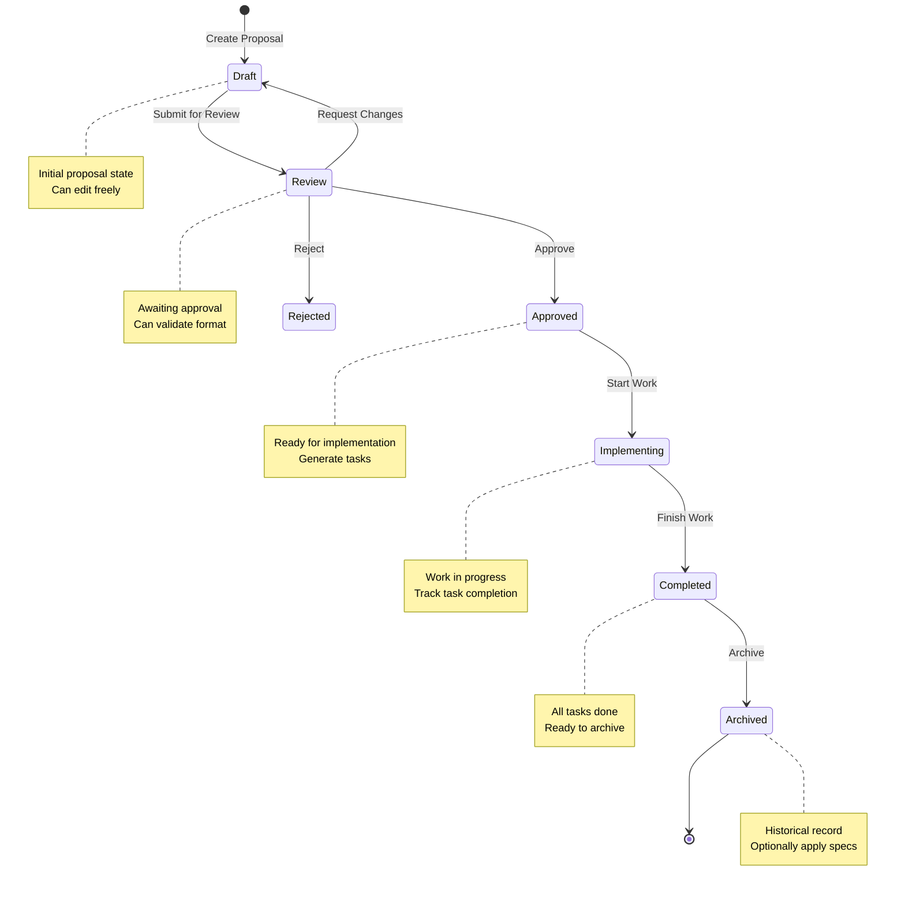
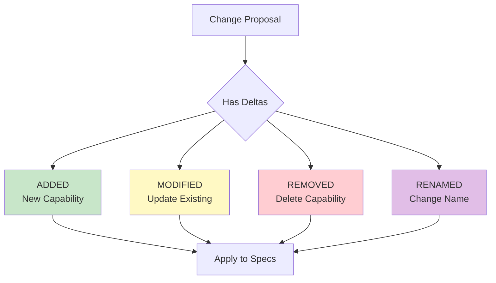
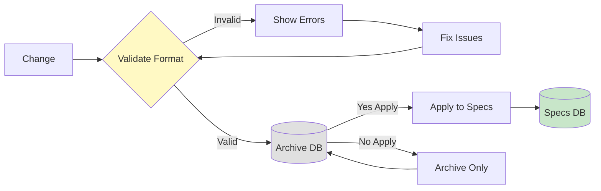

# Changes & Archive

The Changes workflow provides a proposal-based approach to managing specification modifications with approval workflows and task tracking.

## Overview

Changes are the core mechanism for proposing, reviewing, and implementing modifications to your OpenSpec specifications. The workflow ensures all spec changes go through a structured review process before being applied.

### Key Concepts

- **Change Proposal**: A structured document describing proposed specification modifications
- **Deltas**: Individual capability modifications (added/modified/removed/renamed)
- **Status Lifecycle**: Draft → Review → Approved → Implementing → Completed → Archived
- **Task Integration**: Link implementation tasks to change proposals
- **Validation**: Ensure proposals follow OpenSpec format before archiving
- **Archive**: Historical record of completed changes with optional spec application

## Dashboard Interface

### Changes Tab

Access active change proposals via **Project Details → Specs Tab → Changes**.

**Features:**
- List all active changes with status indicators
- Create new change proposals
- View change details and deltas
- Track task completion percentage
- Update change status
- Validate proposal format
- Archive completed changes

### Archive Tab

View historical change records via **Project Details → Specs Tab → Archive**.

**Features:**
- Browse all archived changes
- View implementation details
- See when changes were completed
- Review applied specifications

## Change Status Lifecycle



### Status Descriptions

| Status | Description | Actions Available |
|--------|-------------|-------------------|
| **Draft** | Initial state, editable | Submit for Review, Edit, Delete |
| **Review** | Awaiting approval | Approve, Reject, Request Changes, Validate |
| **Approved** | Approved for work | Start Implementation, Generate Tasks |
| **Implementing** | Work in progress | Update Status, Track Tasks |
| **Completed** | Implementation finished | Archive, Review Tasks |
| **Archived** | Historical record | View Only |

## Delta Operations

Changes consist of deltas that describe specific modifications to capabilities:



### Delta Types

#### ADDED
Create a new capability with requirements and scenarios.

**Example:**
```markdown
## ADDED: User Authentication

### Requirement: Login Flow
WHEN user enters valid credentials
THEN system grants access
AND creates session token
```

#### MODIFIED
Update an existing capability's requirements or scenarios.

**Example:**
```markdown
## MODIFIED: User Authentication

### Requirement: Login Flow (Updated)
WHEN user enters valid credentials
THEN system grants access
AND creates session token
AND logs login timestamp
```

#### REMOVED
Mark a capability as deprecated and remove from active specs.

**Example:**
```markdown
## REMOVED: Legacy API v1

Deprecated in favor of v2 REST API.
```

#### RENAMED
Change a capability's name while preserving its requirements.

**Example:**
```markdown
## RENAMED: Orders → Transactions

Better reflects the broader scope of financial operations.
```

## Creating a Change Proposal

### Via Dashboard

1. Navigate to **Project Details → Specs Tab → Changes**
2. Click **Create Change**
3. Fill in proposal details:
   - **Title**: Brief description (auto-generated from content)
   - **Proposal Markdown**: High-level description of changes
   - **Tasks Markdown**: Implementation tasks in markdown format
   - **Design Markdown** (optional): Technical design notes
   - **PRD Link** (optional): Link to related PRD
4. Add deltas for each capability modification
5. Click **Create**

### Via API

```bash
curl -X POST http://localhost:4001/api/projects/{project_id}/changes \
  -H "Content-Type: application/json" \
  -d '{
    "prdId": "optional-prd-id",
    "proposalMarkdown": "## Add User Authentication...",
    "tasksMarkdown": "- [ ] Implement login endpoint\n- [ ] Add session management",
    "designMarkdown": "Technical notes...",
    "createdBy": "user-id"
  }'
```

## Task Integration

### Parsing Tasks from Markdown

Tasks can be automatically parsed from the `tasksMarkdown` field:

```markdown
- [ ] Implement login endpoint
- [ ] Add session management
  - [ ] Create session table
  - [ ] Implement session cleanup
- [ ] Write tests
```

**Parse tasks:**
```bash
curl -X POST http://localhost:4001/api/projects/{project_id}/changes/{change_id}/tasks/parse
```

### Tracking Task Completion

**Update single task:**
```bash
curl -X PUT http://localhost:4001/api/projects/{project_id}/changes/{change_id}/tasks/{task_id} \
  -H "Content-Type: application/json" \
  -d '{
    "isCompleted": true,
    "completedBy": "user-id"
  }'
```

**Bulk update tasks:**
```bash
curl -X PUT http://localhost:4001/api/projects/{project_id}/changes/{change_id}/tasks/bulk \
  -H "Content-Type: application/json" \
  -d '{
    "tasks": [
      {"taskId": "task-1", "isCompleted": true, "completedBy": "user-id"},
      {"taskId": "task-2", "isCompleted": false}
    ]
  }'
```

## Validation

Before archiving, validate the change format against OpenSpec standards:



### Validation API

```bash
curl http://localhost:4001/api/projects/{project_id}/changes/{change_id}/validate?strict=false
```

**Response:**
```json
{
  "success": true,
  "data": {
    "valid": true,
    "errors": [],
    "deltasValidated": 3
  }
}
```

### Validation Modes

- **Standard** (`strict=false`): Permissive validation for development
- **Strict** (`strict=true`): Rigorous validation for production readiness

**What's validated:**
- OpenSpec markdown format compliance
- Delta structure (title, requirements, scenarios)
- Task markdown format
- Reference integrity

## Archiving Changes

Once a change is completed and all tasks are done, archive it to move it to historical records.

### Archive Without Applying Specs

Store the change as historical record without modifying the specs database:

```bash
curl -X POST http://localhost:4001/api/projects/{project_id}/changes/{change_id}/archive \
  -H "Content-Type: application/json" \
  -d '{
    "applySpecs": false
  }'
```

**Use case:** Document changes that were implemented but don't directly map to spec modifications.

### Archive With Spec Application

Apply all deltas to the specs database and then archive:

```bash
curl -X POST http://localhost:4001/api/projects/{project_id}/changes/{change_id}/archive \
  -H "Content-Type: application/json" \
  -d '{
    "applySpecs": true
  }'
```

**What happens:**
1. Each delta is processed
2. **ADDED** deltas create new capabilities
3. **MODIFIED** deltas update existing capabilities
4. **REMOVED** deltas mark capabilities as deprecated
5. **RENAMED** deltas update capability names
6. Change is marked as archived
7. Change moves to Archive tab

## API Reference

### List Changes

```bash
GET /api/projects/{project_id}/changes?page=1&limit=20&status=approved
```

**Query Parameters:**
- `page`: Page number (default: 1)
- `limit`: Items per page (default: 20)
- `status`: Filter by status (optional)

### Get Change Details

```bash
GET /api/projects/{project_id}/changes/{change_id}
```

**Returns:** Change with all deltas and tasks

### Update Change Status

```bash
PUT /api/projects/{project_id}/changes/{change_id}/status
Content-Type: application/json

{
  "status": "approved",
  "approvedBy": "user-id",
  "notes": "Looks good!"
}
```

### Create Delta

```bash
POST /api/projects/{project_id}/changes/{change_id}/deltas
Content-Type: application/json

{
  "capabilityId": "existing-capability-id",
  "capabilityName": "User Authentication",
  "deltaType": "MODIFIED",
  "deltaMarkdown": "## MODIFIED: User Authentication...",
  "position": 0
}
```

## Best Practices

### Change Proposal Structure

1. **Clear Title**: Use verb + noun (e.g., "Add User Authentication", "Update Payment Flow")
2. **Detailed Proposal**: Explain the "why" behind the change
3. **Specific Tasks**: Break down implementation into concrete steps
4. **Design Notes**: Document technical decisions and considerations

### Delta Organization

1. **One Delta Per Capability**: Keep deltas focused on a single capability
2. **Order Matters**: Use `position` field to maintain logical ordering
3. **Link to PRDs**: Reference the PRD that justifies the change
4. **Complete Markdown**: Include all requirements and scenarios

### Review Process

1. **Validate Early**: Run validation before submitting for review
2. **Link Tasks**: Parse and link implementation tasks before starting work
3. **Track Progress**: Update task completion regularly
4. **Complete Before Archiving**: Ensure all tasks are done before archiving

### Archive Strategy

1. **Apply Specs for Features**: Use `applySpecs: true` for feature implementations
2. **Skip for Experiments**: Use `applySpecs: false` for experimental changes
3. **Review Before Archiving**: Validate one final time before archiving
4. **Document Decisions**: Add notes explaining why changes were made

## Troubleshooting

### Change Not Showing in List

**Check:**
- Status filter (changes might be archived)
- Pagination (change might be on another page)
- Database connection

### Validation Errors

**Common Issues:**
1. **Invalid Markdown**: Ensure deltas follow OpenSpec format
2. **Missing Requirements**: Each capability needs at least one requirement
3. **Malformed Tasks**: Check task markdown syntax

**Fix:**
```bash
# Get validation details
curl http://localhost:4001/api/projects/{project_id}/changes/{change_id}/validate?strict=true

# Check specific delta
curl http://localhost:4001/api/projects/{project_id}/changes/{change_id}/deltas
```

### Archive Failures

**Common Causes:**
1. **Incomplete Tasks**: Some tasks not marked complete
2. **Validation Errors**: Change doesn't pass validation
3. **Database Errors**: Connection or constraint issues

**Debug:**
```bash
# Check task status
curl http://localhost:4001/api/projects/{project_id}/changes/{change_id}/tasks

# Validate format
curl http://localhost:4001/api/projects/{project_id}/changes/{change_id}/validate

# Check logs
tail -f ~/.orkee/logs/orkee.log
```

## Examples

### Feature Addition Example

```json
{
  "prdId": "prd-123",
  "proposalMarkdown": "## Add Two-Factor Authentication\n\nEnhance security by requiring 2FA for admin users.",
  "tasksMarkdown": "- [ ] Add 2FA setup page\n- [ ] Implement TOTP generation\n- [ ] Add backup codes\n- [ ] Write tests",
  "designMarkdown": "## Technical Design\n\nUse TOTP (RFC 6238) with 30-second windows...",
  "createdBy": "user-123"
}
```

### Bug Fix Example

```json
{
  "proposalMarkdown": "## Fix Login Session Timeout\n\nSessions expiring too quickly causing user frustration.",
  "tasksMarkdown": "- [ ] Update session timeout to 30 minutes\n- [ ] Add session refresh on activity\n- [ ] Test timeout behavior",
  "createdBy": "user-456"
}
```

### Refactoring Example

```json
{
  "proposalMarkdown": "## Modernize Payment Processing\n\nReplace legacy payment gateway with Stripe.",
  "tasksMarkdown": "- [ ] Integrate Stripe SDK\n- [ ] Migrate payment methods\n- [ ] Update webhooks\n- [ ] Remove old gateway\n- [ ] Test all payment flows",
  "designMarkdown": "## Migration Strategy\n\n1. Run both gateways in parallel...",
  "createdBy": "user-789"
}
```

## Related Documentation

- [OpenSpec Overview](./overview.md) - Introduction to OpenSpec methodology
- [PRDs](./prds.md) - Product Requirements Documents
- [Specs](./specs.md) - Specifications and capabilities
- [Tasks](./tasks.md) - Task management integration
- [Workflows](./workflows.md) - Complete workflows and processes
- [CLI Reference](./cli-reference.md) - Command-line interface
