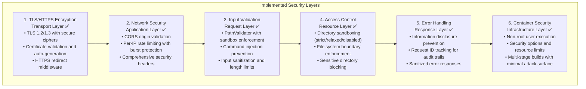

# Security Overview

Orkee implements comprehensive security measures designed for both local development and production deployments. All critical security features are implemented and active, providing defense-in-depth protection suitable for production use.

## Security Status

**Status**: ✅ Production Ready | **Security Score**: 95/100

## Security Philosophy

Orkee follows a **defense-in-depth** strategy with **zero-trust principles**, implementing multiple layers of security:

- **Secure by default** - Safe configurations out of the box
- **Principle of least privilege** - Minimal access rights
- **Defense in depth** - Multiple security layers
- **Transparent security** - Clear security boundaries and controls
- **Production ready** - No authentication required for local CLI use

## Security Implementation Status

| Feature | Status | Implementation | Notes |
|---------|--------|---------------|-------|
| **TLS/HTTPS** | ✅ Complete | rustls, modern ciphers | TLS 1.2/1.3 only |
| **Rate Limiting** | ✅ Complete | Per-endpoint limits | Governor-based |
| **Input Validation** | ✅ Complete | PathValidator | Path traversal protection |
| **Security Headers** | ✅ Complete | CSP, HSTS, X-Frame-Options | Full header suite |
| **CORS Protection** | ✅ Complete | Origin validation | Configurable |
| **Error Sanitization** | ✅ Complete | No info disclosure | Request ID tracking |
| **Directory Sandboxing** | ✅ Complete | 3 modes available | Configurable restrictions |
| **Container Security** | ✅ Complete | Non-root, hardened | Multi-stage builds |
| **Deployment Security** | ✅ Complete | Systemd hardening | Production configs |
| **Audit Logging** | ✅ Complete | Structured logging | Tracing framework |
| **Cloud Authentication** | ✅ Complete | OAuth 2.0 + token storage | Secure auth flow |
| **Cloud API Security** | ✅ Complete | HTTPS + Bearer tokens | Transport security |
| **Token Management** | ✅ Complete | Local secure storage | ~/.orkee/auth.toml |
| **Authentication** | ⚠️ By Design | Not implemented | Local CLI tool |

## Threat Model

### Attack Vectors Addressed ✅

| Threat | Protection | Implementation | Status |
|--------|------------|----------------|--------|
| **Path Traversal** | Directory sandboxing | Configurable sandbox modes | ✅ Active |
| **Command Injection** | Input validation | Dangerous pattern detection | ✅ Active |
| **CSRF Attacks** | CORS restrictions | Origin allowlisting | ✅ Active |
| **Rate Limit Bypass** | Per-IP rate limiting | Token bucket algorithm | ✅ Active |
| **Information Disclosure** | Sanitized errors | Request ID tracking | ✅ Active |
| **Clickjacking** | Security headers | X-Frame-Options: DENY | ✅ Active |
| **TLS Attacks** | Modern encryption | TLS 1.2/1.3, secure ciphers | ✅ Active |
| **Privilege Escalation** | Process isolation | Non-root execution | ✅ Active |
| **DoS Attacks** | Rate limiting | Burst protection | ✅ Active |
| **MITM Attacks** | TLS encryption | Certificate validation | ✅ Active |
| **Cloud Data Interception** | HTTPS/TLS | Transport encryption | ✅ Active |
| **Token Theft** | Local secure storage | File permissions & encryption | ✅ Active |
| **API Abuse** | Authentication tokens | Bearer token validation | ✅ Active |
| **Replay Attacks** | Nonce generation | Crypto secure RNG | ✅ Active |

### Trust Boundaries

**Current Security Model:**
- **Local Development**: Single-user development machine (primary use case)
- **Trusted Network**: Team environment with network access
- **Production**: Behind reverse proxy with additional security

**Assumed Threats:**
- Malicious directory traversal attempts
- Automated vulnerability scanning
- Rate limiting bypass attempts
- Input injection attacks
- Network-based attacks (when exposed)

## Security Architecture



## Key Security Features

### 1. Transport Layer Security (TLS/HTTPS)

- **Native Rust TLS** using rustls library
- **TLS 1.2/1.3 only** with secure cipher suites
- **Automatic certificate generation** for development
- **Certificate validation** and expiry checking
- **Dual server mode** with HTTP-to-HTTPS redirect

### 2. Rate Limiting

- **Per-IP address tracking** using Governor crate
- **Endpoint-specific rate limits** with burst protection
- **Configurable thresholds** per endpoint category
- **Retry-After headers** for rate-limited responses

### 3. Input Validation & Sandboxing

- **Comprehensive PathValidator** with three security modes
- **Path traversal detection** and prevention
- **Command injection protection**
- **Canonical path resolution**

### 4. Security Headers

Complete security header suite including:
- **Content Security Policy (CSP)**
- **X-Content-Type-Options**: `nosniff`
- **X-Frame-Options**: `DENY`
- **X-XSS-Protection**: `1; mode=block`
- **Referrer-Policy**: `strict-origin-when-cross-origin`
- **Permissions-Policy**: Disables dangerous browser APIs
- **HSTS**: HTTP Strict Transport Security (for HTTPS)

### 5. CORS Protection

- **Strict allowlist** of permitted origins
- **Configurable origin validation**
- **Credentials explicitly disabled**
- **Development flexibility** with localhost support

### 6. Error Handling & Audit Logging

- **Sanitized error responses** (no internal details)
- **Request ID correlation** for audit trails
- **Comprehensive structured logging**
- **Security event markers** for monitoring

## Security Modes

Orkee supports three directory browsing security modes:

import Tabs from '@theme/Tabs';
import TabItem from '@theme/TabItem';

<Tabs>
<TabItem value="relaxed" label="Relaxed Mode (Default)" default>

**Best for**: Local development environments

**Configuration**:
```bash
BROWSE_SANDBOX_MODE=relaxed
```

**Features**:
- ✅ Home directory access allowed
- ✅ Controlled path traversal within safe boundaries  
- ❌ System directories blocked
- ❌ Sensitive user directories blocked

</TabItem>
<TabItem value="strict" label="Strict Mode">

**Best for**: Production and high-security environments

**Configuration**:
```bash
BROWSE_SANDBOX_MODE=strict
ALLOWED_BROWSE_PATHS="/var/app/safe,/opt/app/public"
```

**Features**:
- ✅ Only explicitly allowed paths accessible
- ❌ All path traversal blocked
- ❌ Root access blocked unless explicitly allowed
- ❌ All system directories blocked

</TabItem>
<TabItem value="disabled" label="Disabled Mode">

**Best for**: Debugging only (NOT RECOMMENDED)

**Configuration**:
```bash
BROWSE_SANDBOX_MODE=disabled
```

**Features**:
- ⚠️ Access to any readable directory
- ⚠️ No security restrictions
- **Use case**: Debugging only, never for production

</TabItem>
</Tabs>

## Always Blocked Paths

The following paths are **always blocked** regardless of security mode:

### System Directories
- `/etc`, `/private/etc` (system configuration)
- `/sys`, `/proc`, `/dev` (virtual filesystems)
- `/usr/bin`, `/usr/sbin`, `/bin`, `/sbin` (system binaries)
- `/var/log`, `/var/run`, `/var/lock` (system runtime)
- `/boot`, `/root`, `/mnt`, `/media`, `/opt`
- `/tmp`, `/var/tmp` (temporary directories)

### Windows System Directories
- `C:\Windows`, `C:\System32`
- `C:\Program Files`, `C:\Program Files (x86)`
- `C:\ProgramData`

### Sensitive User Directories
- `.ssh`, `.aws`, `.gnupg` (credentials)
- `.docker`, `.kube` (container configs)
- `.config/git`, `.gitconfig` (Git configuration)
- `.npm`, `.cargo/credentials` (package managers)
- `.env*` files (environment variables)
- `Library/Keychains` (macOS keychain)
- `AppData/Local/Microsoft` (Windows credentials)

## Security Configuration

### Basic Security Setup

```bash
# Recommended production configuration
BROWSE_SANDBOX_MODE=strict
ALLOWED_BROWSE_PATHS="/var/app/safe,/opt/app/public"

# Rate limiting
RATE_LIMIT_ENABLED=true
RATE_LIMIT_GLOBAL_RPM=15
RATE_LIMIT_BURST_SIZE=2

# Security headers
SECURITY_HEADERS_ENABLED=true
ENABLE_HSTS=true
ENABLE_REQUEST_ID=true

# TLS configuration
TLS_ENABLED=true
AUTO_GENERATE_CERT=false
TLS_CERT_PATH="/etc/ssl/certs/orkee.crt"
TLS_KEY_PATH="/etc/ssl/private/orkee.key"
```

### Development Configuration

```bash
# Development-friendly security
BROWSE_SANDBOX_MODE=relaxed
RATE_LIMIT_ENABLED=true
SECURITY_HEADERS_ENABLED=true
TLS_ENABLED=false  # HTTP OK for local development
```

## Audit & Monitoring

### Security Events Logged

Orkee automatically logs security-relevant events:

```json
{
  "timestamp": "2024-01-15T10:30:00Z",
  "level": "warn",
  "event": "rate_limit_exceeded",
  "ip": "192.168.1.100",
  "endpoint": "/api/projects",
  "limit": 30,
  "request_id": "req_abc123"
}
```

### Monitoring Recommendations

1. **Rate limit violations**: Monitor for unusual traffic patterns
2. **Path traversal attempts**: Alert on blocked directory access
3. **Authentication failures**: Track cloud auth issues
4. **Certificate expiry**: Monitor TLS certificate validity
5. **Configuration changes**: Audit security setting modifications

### Log Analysis Commands

```bash
# Monitor rate limit violations
grep "rate_limit_exceeded" /var/log/orkee.log

# Check path traversal attempts
grep "path_traversal_blocked" /var/log/orkee.log

# Monitor authentication events
grep "auth_" /var/log/orkee.log | jq '.event'

# Security event summary
grep -E "(security|auth|rate_limit)" /var/log/orkee.log | \
  jq -r '.event' | sort | uniq -c
```

## Security Best Practices

### For Development

1. **Use relaxed mode** for local development
2. **Enable rate limiting** to catch issues early
3. **Monitor logs** for unexpected security events
4. **Test with strict mode** before production deployment

### For Production

1. **Use strict mode** for directory browsing
2. **Enable all security features**
3. **Use HTTPS** with valid certificates
4. **Deploy behind reverse proxy** for additional security
5. **Monitor and alert** on security events
6. **Regular security updates** and audits
7. **Implement principle of least privilege**

### For Teams

1. **Consistent security policies** across environments
2. **Security training** for development team
3. **Regular security reviews** and penetration testing
4. **Incident response procedures** for security events

## Compliance & Standards

Orkee security implementation follows industry standards:

- **OWASP Top 10** protection measures
- **NIST Cybersecurity Framework** alignment
- **Defense in Depth** architecture principles
- **Zero Trust** security model concepts
- **Industry best practices** for web application security

## Security Resources

For detailed information on specific security topics:

- [Authentication](authentication) - User authentication and OAuth flows
- [TLS/HTTPS Configuration](tls-https) - Transport layer security setup
- [Rate Limiting](rate-limiting) - Request rate limiting and DoS protection
- [Sandbox Modes](sandbox-modes) - Directory access controls and validation

## Security Support

### Reporting Security Issues

If you discover a security vulnerability:

1. **DO NOT** file a public issue
2. Email security details to: [security@orkee.ai](mailto:security@orkee.ai)
3. Include detailed steps to reproduce
4. Allow reasonable time for response and fixes

### Security Updates

- Security updates are prioritized and released quickly
- Subscribe to security announcements via GitHub releases
- Follow [@OrkeeAI](https://twitter.com/OrkeeAI) for security alerts
- Join our [Discord community](https://discord.gg/orkee) for discussions

### Security Audits

Orkee undergoes regular security reviews:

- **Internal audits**: Monthly security reviews
- **External audits**: Annual third-party security assessments
- **Community reviews**: Open source security community feedback
- **Automated scanning**: Continuous dependency and vulnerability scanning